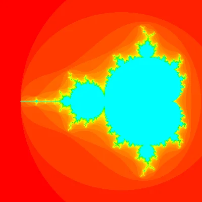

# How to draw a fractal with Python

The idea of this lightning talk was to show how little effort is needed to create a beautiful fractal image with Python and pygame.

This lightning talk was based off of [this article on my blog about the Mandelbrot set](https://mathspp.com/blog/mandelbrot-set).

