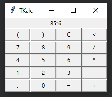

# Elegant (line of) code

In this lighthearted lightning talk I took a Python script for a tkinter calculator and continuously refactored it until the whole calculator was a single expression.
We managed to get some laughs out of this ridiculous process, while we also explored a couple of interesting Python features like conditional expressions, Boolean short-circuiting, and assignment expressions.

In this reprise of the lightning talk I presented at PyCon Ireland 2023, I had to wear a special pair of glasses and present if I were a thug.
I failed miserably but everyone got a good laugh out of it, so it ended up being a success!

The final code looked like this:

The lightning talk was based off of [this blog article of mine](https://mathspp.com/blog/single-line-calculator).

The tkinter calculator looks like this:

